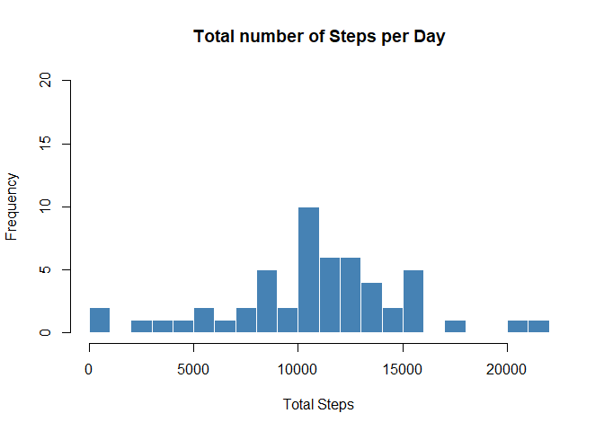
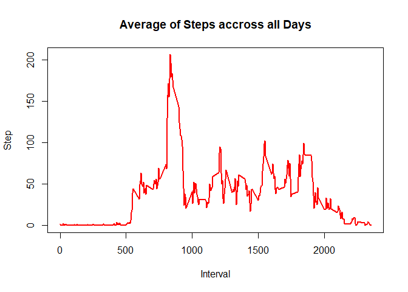
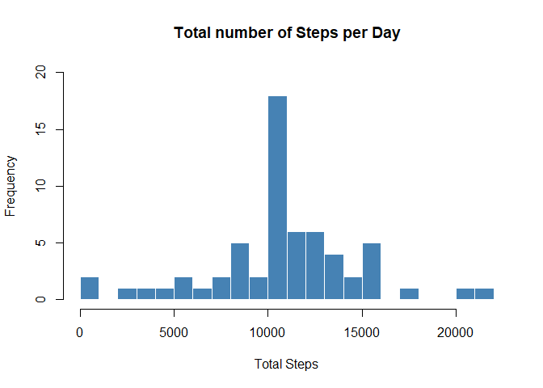
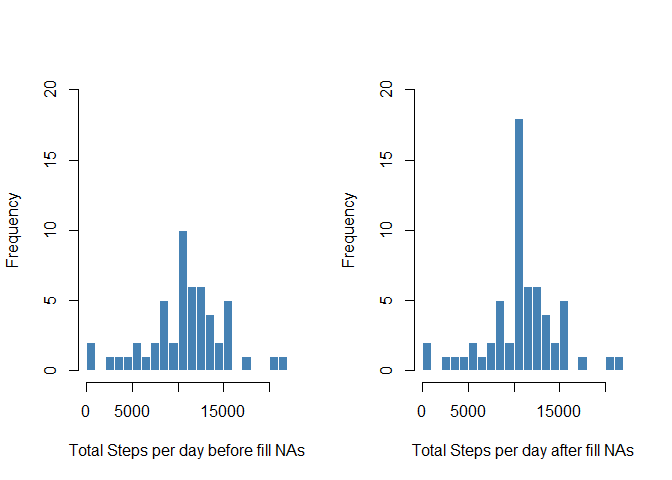
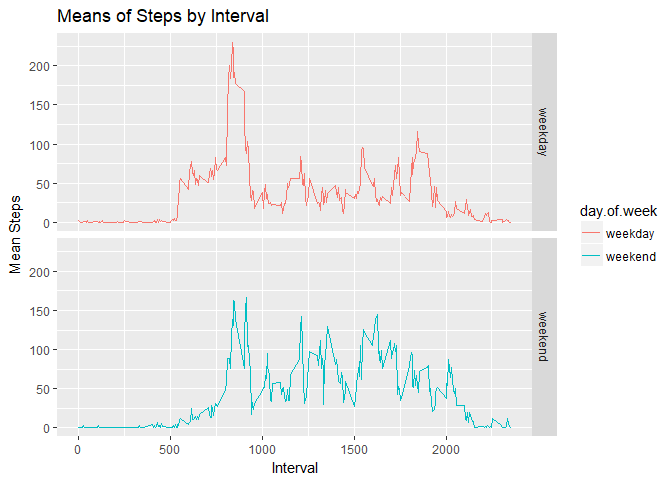

### Setup to show every code chunks

```r
knitr::opts_chunk$set(echo = TRUE)
```

## Loading and preprocessing the data  
Look at data summary and few first lines


```r
data=read.csv("activity.csv")
data$date=as.Date(as.character(data$date))
summary(data)
```

```
##      steps             date               interval     
##  Min.   :  0.00   Min.   :2012-10-01   Min.   :   0.0  
##  1st Qu.:  0.00   1st Qu.:2012-10-16   1st Qu.: 588.8  
##  Median :  0.00   Median :2012-10-31   Median :1177.5  
##  Mean   : 37.38   Mean   :2012-10-31   Mean   :1177.5  
##  3rd Qu.: 12.00   3rd Qu.:2012-11-15   3rd Qu.:1766.2  
##  Max.   :806.00   Max.   :2012-11-30   Max.   :2355.0  
##  NA's   :2304
```

```r
head(data)
```

```
##   steps       date interval
## 1    NA 2012-10-01        0
## 2    NA 2012-10-01        5
## 3    NA 2012-10-01       10
## 4    NA 2012-10-01       15
## 5    NA 2012-10-01       20
## 6    NA 2012-10-01       25
```
## What is mean total number of steps taken per day?

**1. Total steps taken on each day**

```r
byStep=aggregate(data$steps,by=list(data$date),sum)
names(byStep)=c("Date","TotalSteps")
head(byStep)
```

```
##         Date TotalSteps
## 1 2012-10-01         NA
## 2 2012-10-02        126
## 3 2012-10-03      11352
## 4 2012-10-04      12116
## 5 2012-10-05      13294
## 6 2012-10-06      15420
```

**2. Histogram of the total number of steps taken each day**

```r
hist(byStep$TotalSteps,breaks = 25,col = "steelblue",border = "white",
     main = "Total number of Steps per Day", xlab = "Total Steps",ylim = c(0,20))
```

<!-- -->

**3. Mean and median of the total number of steps taken per day**


```r
mean=round(mean(byStep$TotalSteps,na.rm=TRUE),2)
median=round(median(byStep$TotalSteps,na.rm = TRUE),2)
```

- Mean of the total number of steps taken per day is: 10766.19
- Median of the total number of steps taken per day is: 10765

## What is the average daily activity pattern?

**1. Time series plot (i.e. type = "l") of the 5-minute interval (x-axis) and the average number of steps taken, averaged across all days (y-axis)**


```r
byInterval=aggregate(na.omit(data)$steps,by=list(na.omit(data)$interval),mean)
names(byInterval)=c("Interval","Mean.Steps")

plot(x=byInterval$Interval,y=byInterval$Mean.Steps,type = "l",col =10,lwd=2,main ="Average of Steps accross all Days",xlab="Interval",ylab = "Step")
```

<!-- -->

**2. The 5-minute interval, on average across all the days in the dataset, contains the maximum number of steps**


```r
byInterval[byInterval$Mean.Steps==max(byInterval$Mean.Steps),]
```

```
##     Interval Mean.Steps
## 104      835   206.1698
```

## Imputing missing values
**1. Total number of missing values in the dataset (i.e. the total number of rows with NAs)**


```r
sapply(X=data,FUN = function(x) sum(is.na(x)))
```

```
##    steps     date interval 
##     2304        0        0
```

**2. All the NAs will be replaced by the mean of steps taken on its interval**

**3. New dataset that is equal to the original dataset but with the missing data filled in.**


```r
 complete.data=data
for (i in c(which(is.na(data$steps)))) {
  complete.data$steps[i]=byInterval[which(byInterval$Interval==data$interval[i]),2]
}
 sapply(X=complete.data,FUN = function(x) sum(is.na(x)))
```

```
##    steps     date interval 
##        0        0        0
```

**4. Histogram of the total number of steps taken each day**


```r
byStep.new=aggregate(complete.data$steps,by=list(complete.data$date),sum)
names(byStep.new)=c("Date","TotalSteps")
hist(byStep.new$TotalSteps,breaks = 25,col = "steelblue",border = "white",
     main = "Total number of Steps per Day", xlab = "Total Steps",
     ylim = c(0,20))
```

<!-- -->

**5. Any differences in mean and median between original data and data with NAs replaced?**  

Compare between histogram


```r
newmean=round(mean(byStep.new$TotalSteps),2)
newmedian=round(median(byStep.new$TotalSteps),2)
par(mfrow=c(1,2))
hist(byStep$TotalSteps,breaks = 25,col = "steelblue",border = "white",
     main=NULL,xlab = "Total Steps per day before fill NAs",ylim = c(0,20))
hist(byStep.new$TotalSteps,breaks = 25,col = "steelblue",border = "white",
     main=NULL,xlab = "Total Steps per day after fill NAs",
     ylim = c(0,20))
```

<!-- -->

- New Mean of the total number of steps taken per day is: 10766.19
- New median of the total number of steps taken per day is: 10766.19
- The mean between those two data is the same which is 10766.19. However, the median rise from 10765 to 10766.19

## Are there differences in activity patterns between weekdays and weekends?

**1. New factor variable in the dataset with two levels - "weekday" and "weekend" indicating whether a given date is a weekday or weekend day**


```r
new.data=complete.data
new.data$day.of.week=ifelse(weekdays(as.Date(new.data$date)) %in% c("Saturday","Sunday"),
                     "weekend","weekday")
new.data=aggregate(new.data$steps,by=list(new.data$interval,new.data$day.of.week),mean)
names(new.data)=c("Interval","day.of.week","Mean.Steps")
head(new.data)
```

```
##   Interval day.of.week Mean.Steps
## 1        0     weekday 2.25115304
## 2        5     weekday 0.44528302
## 3       10     weekday 0.17316562
## 4       15     weekday 0.19790356
## 5       20     weekday 0.09895178
## 6       25     weekday 1.59035639
```

**2. Panel plot containing a time series plot (i.e. type = "l") of the 5-minute interval (x-axis) and the average number of steps taken, averaged across all weekday days or weekend days (y-axis)**


```r
library(ggplot2)
ggplot(new.data,aes(x=Interval,y=Mean.Steps,color=day.of.week))+
  geom_line()+
  facet_grid(day.of.week~.)+
  labs(title="Means of Steps by Interval", x="Interval",y="Mean Steps")
```

<!-- -->
